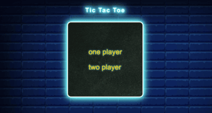
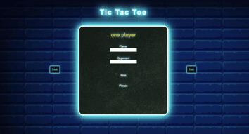
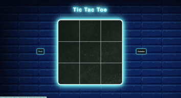

# Tic Tac Toe

  
Contenido 📝

  <ol>
    <li><a href="#objetivo-🎯">Objetivo</a></li>
    <li><a href="#sobre-el-proyecto-🔎">Sobre el proyecto</a></li>
    <li><a href="#deploy-🚀">Deploy</a></li>
    <li><a href="#stack">Stack</a></li>
    <li><a href="#vistas">Vistas</a></li>
    <li><a href="#contacto">Contacto</a></li>
  </ol>

## Objetivo 🎯
El objetivo de este ejercicio es crear un programa que nos permita jugar al
tres en raya contra un oponente humano o contra la máquina. Poniendo en práctica los conocimientos de HTML5, CSS3 y Javascript.

## Sobre el proyecto 🔎
Decidí crear la web de un restaurante cercano a mi casa, el cual vi que no tiene web propia. 
Y lo dividí las siguientes pestañas:
- Menú
- Un jugador
- Dos jugadores
- Partida
- Ganador

## Deploy 🚀

    <a href="https://adriaarigola.github.io/Proyecto-3-TicTacToe/"><strong>Url a producción </strong></a>🚀🚀🚀

  

## Stack

## Vistas
Landing Menú
 
 
Landing Opciones

 
Landing Partida

## Contacto

